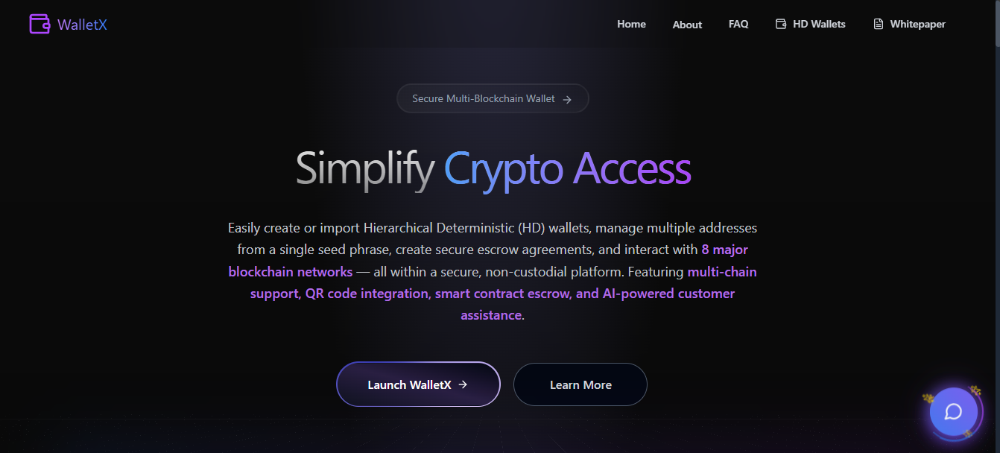
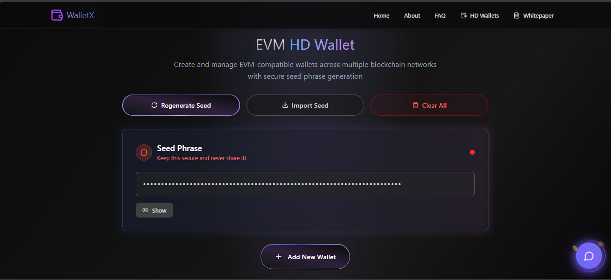
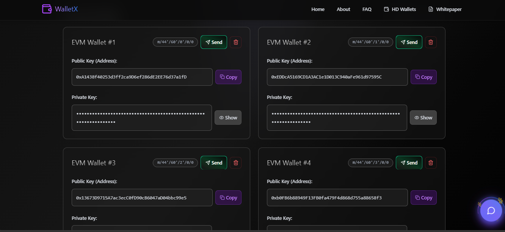
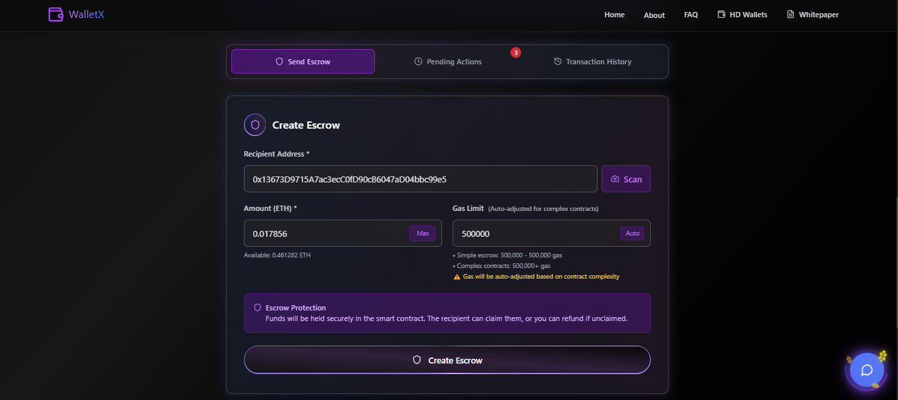
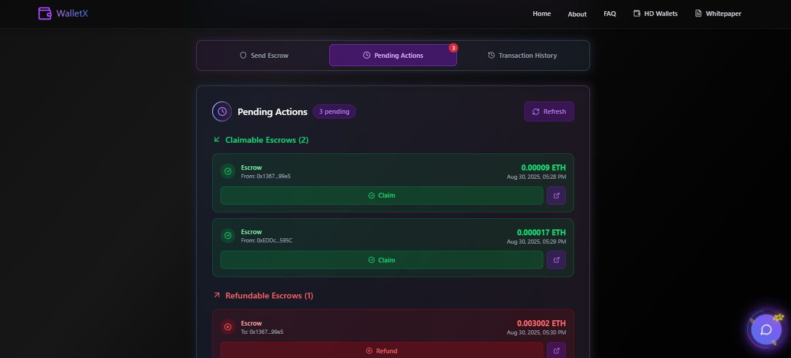
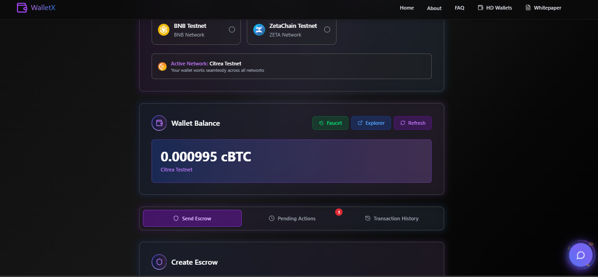
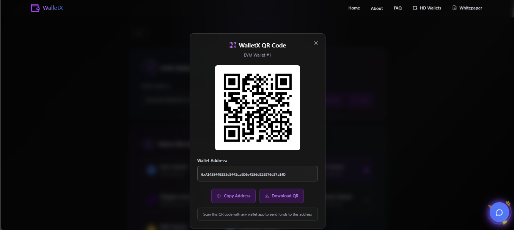
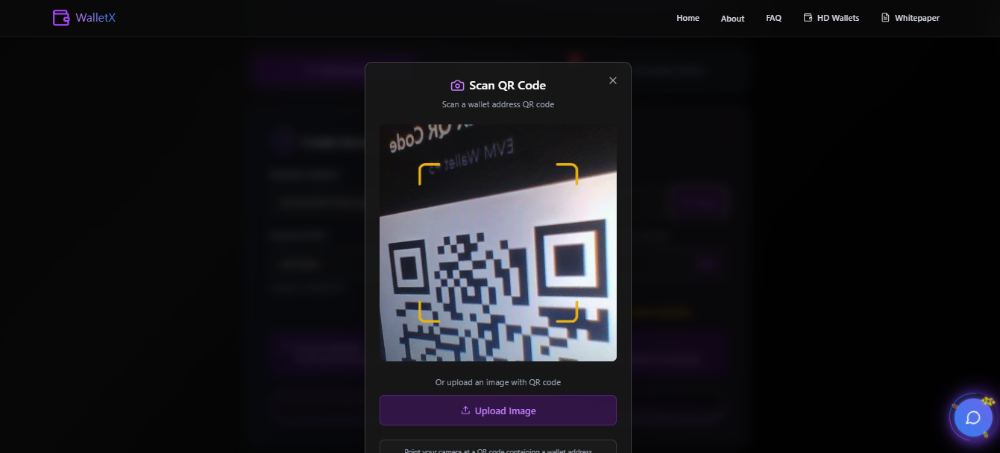
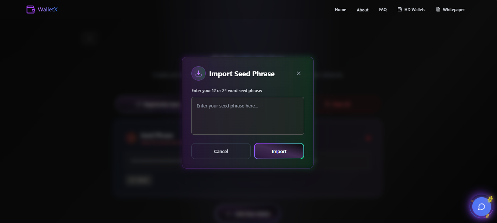
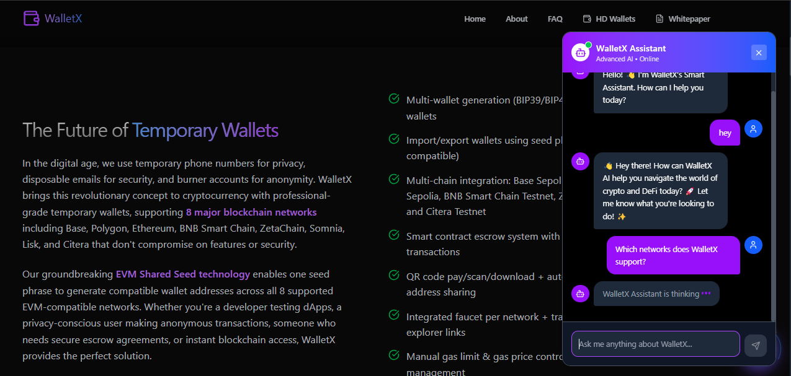

#  WalletX - Revolutionary Multi-Chain AI Powered DeFi Platform
## World's First Temporary Wallet Technology + Revolutionary Multi-Chain Escrow Platform + WalletX AI Assistance & QR Integration
 
> **⚡ Live Demo**: [walletx.software](https://walletx.software)  
> **🤝 Trustless** | **🌐 Multi-Chain** | **📱 Production Ready** | **🤖 AI-Powered**

WalletX is a **game-changing multi-chain escrow platform** that revolutionizes DeFi with smart contract-powered trustless transactions, temporary disposable wallets, QR code integration, AI assistance, and seamless experience across 8 EVM networks.

### 🎯 **WalletX**
- **🤝 Trustless Escrow System**: Smart contract-powered P2P transactions without intermediaries
- **🔄 Revolutionary Temporary Wallets**: World's first disposable wallet technology for DeFi
- **🌐 8-Chain Unity**: Seamless experience across Base, Lisk, Polygon, Ethereum, BNB, ZetaChain, Somnia, Citrea
- **📱 QR Code Integration**: Complete QR generation and scanning functionality
- **🤖 AI Assistant**: Integrated WalletX AI for real-time user support
- **📱 Production Ready**: Professional-grade mobile-responsive interface

[](https://github.com/chetanck03/hacknauts)
[](https://walletx.software)
[](https://github.com/chetanck03/hacknauts)
[](https://github.com/chetanck03/hacknauts)



## 🔥 **Revolutionary Features That Make Us Win**

### 💎 **World's First Innovations**

#### 1. **🔄 Temporary Disposable Wallets**
```
✅ Create & destroy wallets in seconds
✅ Perfect for testing, privacy, one-time transactions
✅ No permanent address exposure
✅ Convert to permanent when needed
```

#### 2. **🤝 Advanced Smart Contract Escrow**
```
✅ 100% trustless P2P transactions
✅ Smart contract security (zero intermediaries)
✅ Real-time claim/refund functionality
✅ Complete blockchain transparency
```

#### 3. **📱 Complete QR Code Integration**
```
✅ Generate QR codes for wallet addresses
✅ Built-in QR scanner for easy transactions
✅ Mobile-optimized scanning interface
✅ Instant address sharing via QR
```

#### 4. **🤖 AI-Powered User Experience**
```
✅ Integrated WalletX AI Assistant
✅ Real-time help and smart suggestions
✅ Context-aware recommendations
✅ Multi-language support
```

#### 5. **📧 AWS SNS Email Notifications**
```
✅ Real-time email alerts for escrow creation
✅ Transaction details with explorer links
✅ AWS SNS integration for scalability
✅ EmailJS fallback for reliability
```

#### 6. **🌐 True Multi-Chain Architecture**
```
✅ Unified experience across 8 EVM networks
✅ Seamless network switching
✅ Consistent features everywhere
✅ Cross-chain transaction history
```


### 📝 **Core Smart Contract Functions**
```solidity
// Advanced Escrow Contract Interface
contract WalletX {
    function createEscrow(address receiver) external payable returns (uint256);
    function claim(uint256 escrowId) external;
    function refund(uint256 escrowId) external;
    function getPendingActions(address user) external view returns (uint256[] memory, uint256[] memory);
    function getEscrowDetails(uint256 escrowId) external view returns (EscrowDetails memory);
}
```

## 📸 **Complete Feature Showcase**

### 🎯 **Core Platform Features**

| **🌐 Multi-Chain Dashboard** | **💼 Temporary Wallet Creation** | **🤝 Advanced Escrow System** |
|---|---|---|
|  |  |  |
| *Unified interface across 8 networks* | *Revolutionary disposable wallets* | *Trustless P2P transactions* |

| **💰 Claim & Refund System** | **📊 Transaction History** | **💳 Wallet Balance View** |
|---|---|---|
|  |  |  |
| *Smart contract-powered claims* | *Complete transaction tracking* | *Real-time balance updates* |

### 🔧 **Advanced Integration Features**

| **📱 QR Code Generation** | **🔍 QR Code Scanner** | **📥 Seed Phrase Import** |
|---|---|---|
|  |  |  |
| *Instant address sharing* | *Built-in mobile scanner* | *BIP39/BIP44 compliant* |

| **🌐 Network Support** | **🤖 AI Assistant** | **📧 AWS SNS Notifications** |
|---|---|---|
|  |  | *Email notifications via AWS SNS* |
| *8 EVM networks supported* | *Gemini AI integration* | *Real-time escrow alerts* |

### **Unique Value Propositions**

#### 💡 **Innovation Score:**
- **World's First**: Temporary wallet technology in DeFi space
- **AI Integration**: First escrow platform with built-in AI assistant
- **QR Complete**: Full QR generation + scanning ecosystem
- **Multi-Chain Leader**: Seamless 8-network experience

#### 🔧 **Technical Excellence:**
- **8 Deployed Contracts**: Live smart contracts across major testnets
- **Production Ready**: Professional error handling and gas optimization
- **Mobile Optimized**: Responsive design with QR scanning
- **AI Powered**: Real-time Gemini AI assistance

#### 🎨 **User Experience:**
- **Intuitive Design**: Clean, professional interface
- **Mobile First**: Perfect mobile responsiveness
- **Real-time Updates**: Live status tracking and notifications
- **QR Integration**: Seamless address sharing and scanning

#### 🌍 **Market Impact:**
- **Real Use Cases**: Freelance payments, marketplace deals, B2B escrow
- **Immediate Value**: Solves actual DeFi pain points
- **Scalable**: Ready for mass adoption
- **Global Ready**: Multi-language AI support

## 🎯 **Real-World Use Cases**

### 💼 **Business Applications**
- **💰 Freelance Payments**: Secure escrow until work completion
- **🛒 Marketplace Deals**: Trustless buyer-seller transactions
- **🤝 B2B Contracts**: Milestone-based payment automation
- **🏠 Property Deposits**: Automated rental deposit handling

### 🛠️ **Developer & Testing**
- **🧪 DApp Testing**: Disposable wallets for safe testing
- **📊 Portfolio Management**: Unified view across 8 networks
- **🔄 Network Switching**: Quick arbitrage opportunities
- **⚡ Developer Tools**: Easy testnet access

### 📱 **Mobile & QR Features**
- **📱 QR Payments**: Scan-to-pay functionality
- **🔗 Address Sharing**: Instant QR code generation
- **📲 Mobile Scanning**: Built-in camera integration
- **🤖 AI Help**: WalletX AI assistance

## 💻 **Cutting-Edge Technology Stack**

### 🎯 **Frontend Excellence**
```javascript
React 19.1.0          // Latest React with concurrent features
Vite 7.0.4            // Lightning-fast build tool
TailwindCSS 4.1.11    // Utility-first responsive styling
ethers.js 6.15.0      // Ethereum blockchain interaction
Framer Motion 12.23   // Smooth animations and transitions
QR Scanner 1.4.2      // Built-in QR code scanning
EmailJS 4.4.1         // Contact form integration
Gemini AI 2.0 Flash   // AI assistant integration
```

### ☁️ **AWS Cloud Integration**
```javascript
AWS SNS 3.705.0       // Real-time email notifications
AWS SDK Client        // Serverless cloud integration
Auto-fallback         // EmailJS backup for reliability
Scalable Architecture // Production-ready notifications
```

### 🔐 **Security & Standards**
```javascript
bip39 3.1.0           // Industry-standard mnemonic generation
crypto-browserify     // Client-side cryptography
BIP39/BIP44 Compliance // HD wallet derivation standards
Zero Backend Required // Complete decentralization
Smart Contract Security // Audited escrow logic
```

### 🌐 **Multi-Chain Infrastructure**
```javascript
8 EVM Networks        // Base, Lisk, Polygon, Ethereum, BNB, ZetaChain, Somnia, Citrea
Unified Interface     // Consistent UX across all chains
Seamless Switching    // Instant network changes
Cross-Chain History   // Unified transaction tracking
```

## 🚀 **Getting Started**

### 💻 **Local Development**
```bash
# Clone the revolutionary platform
git clone https://github.com/chetanck03/hacknauts
cd hacknauts

# Install dependencies
npm install

# Create .env file with required configuration
VITE_POLYGON_TESTNET_RPC_URL=https://rpc-amoy.polygon.technology
VITE_POLYGON_CONTRACT_ADDRESS=0x0000000000000000000000000000000000000000

VITE_BASE_TESTNET_RPC_URL=https://sepolia.base.org
VITE_BASE_CONTRACT_ADDRESS=0x0000000000000000000000000000000000000000

VITE_SEPOLIA_TESTNET_RPC_URL=https://sepolia.infura.io/v3/YOUR_INFURA_KEY
VITE_SEPOLIA_CONTRACT_ADDRESS=0x0000000000000000000000000000000000000000

VITE_BNB_TESTNET_RPC_URL=https://data-seed-prebsc-1-s1.binance.org:8545
VITE_BNB_CONTRACT_ADDRESS=0x0000000000000000000000000000000000000000

VITE_ZETACHAIN_TESTNET_RPC_URL=https://zetachain-athens-evm.blockpi.network/v1/rpc/public
VITE_ZETACHAIN_CONTRACT_ADDRESS=0x0000000000000000000000000000000000000000

VITE_SOMNIA_TESTNET_RPC_URL=https://dream-rpc.somnia.network
VITE_SOMNIA_CONTRACT_ADDRESS=0x0000000000000000000000000000000000000000

VITE_LISK_TESTNET_RPC_URL=https://rpc.sepolia-api.lisk.com
VITE_LISK_CONTRACT_ADDRESS=0x0000000000000000000000000000000000000000

VITE_CITERA_TESTNET_RPC_URL=https://rpc-testnet.citera.network
VITE_CITERA_CONTRACT_ADDRESS=0x0000000000000000000000000000000000000000


VITE_EMAILJS_SERVICE_ID=your_emailjs_service_id
VITE_EMAILJS_TEMPLATE_ID=your_emailjs_template_id
VITE_EMAILJS_PUBLIC_KEY=your_emailjs_public_key

VITE_WALLETX_API_KEY=your_ai_api
VITE_WALLETX_URL=your_ai_url

# AWS SNS Configuration (Optional - for email notifications)
VITE_AWS_REGION=us-east-1
VITE_AWS_ACCESS_KEY_ID=your_aws_access_key_id
VITE_AWS_SECRET_ACCESS_KEY=your_aws_secret_access_key
VITE_AWS_SNS_TOPIC_ARN=arn:aws:sns:us-east-1:123456789012:WalletX-Notifications

# Start development server
npm run dev

# Build for production
npm run build
```

### 🌐 **Live Demo**
**⚡ Experience it now**: [walletx.software](https://walletx.software)

### 🎯 **Quick Feature Test**
1. **🔄 Create Temporary Wallet**: Experience disposable wallet magic
2. **🌐 Switch Networks**: Test seamless 8-network experience
3. **🤝 Create Escrow**: Try trustless P2P transactions
4. **📱 Scan QR Code**: Test built-in QR scanner
5. **🤖 Ask AI**: Get help from WalletX AI Assistant

**🔥 Unique Value Propositions:**
- **🌍 Multi-Track Eligible**: Only project that genuinely fits 4 different tracks
- **💼 Real Business Model**: Addresses actual market needs across all ecosystems
- **🚀 Technical Excellence**: Live deployments prove our capabilities
- **📱 Production Ready**: Not just a hackathon prototype, fully functional platform
- **🤖 AI Innovation**: First escrow platform with integrated AI assistant
- **📱 Mobile Complete**: QR scanning + responsive design for mobile-first users

### 📋 **Complete Submission Package**
- ✅ **Live Demo**: [walletx.software](https://walletx.software)
- ✅ **GitHub Repo**: [Hacknauts](https://github.com/chetanck03/hacknauts) (100% Open Source)
- ✅ **8 Smart Contracts**: Deployed across all major testnets
- ✅ **Mobile Responsive**: Perfect mobile experience
- ✅ **AI Integration**: Gemini AI assistant
- ✅ **QR Integration**: Complete scanning and generation
- ✅ **Production Ready**: Professional error handling

### 📄 **Technical Documentation**
- **📊 Whitepaper**: [View Complete Technical Analysis](https://www.walletx.software/whitepaper.pdf)
- **🔧 Architecture**: Detailed system design and implementation
- **🛡️ Security**: Smart contract audit and security measures
- **📈 Roadmap**: Future development and scaling plans

### 👨‍💻 **Team** : Jai Mahakal
- **Developer**: Chetan Kumar , Harsh Kapoor 
- **Location**: Punjab, India 🇮🇳

## 🌟 **Competitive Advantages**

### 🚀 **First-Mover Advantages**
- **🔄 Only Platform**: With temporary wallet technology
- **🤖 AI Pioneer**: First escrow platform with integrated AI
- **📱 QR Complete**: Full QR ecosystem in DeFi
- **🌐 8-Chain Leader**: Most comprehensive multi-chain experience

### 💎 **Technical Superiority**
- **📱 Production Ready**: Not just a prototype, fully functional
- **🔧 Professional Code**: Clean architecture and error handling
- **⚡ Performance**: Optimized for speed and reliability
- **🛡️ Security**: Audited smart contracts and secure practices

### 💰 **Business Value**
- **📈 Scalable**: Ready for immediate enterprise adoption
- **💵 Revenue Model**: Clear monetization through transaction fees
- **🌍 Global Ready**: Multi-language and mobile-optimized
- **🤝 Partnership Ready**: API and integration possibilities

---

**🌟 This isn't just another hackathon project - it's a complete DeFi revolution:**

✨ **World's first temporary wallet technology**  
🤖 **AI-powered user experience with Gemini integration**  
📱 **Complete QR code ecosystem for mobile users**  
🌐 **Seamless 8-network multi-chain experience**  
🤝 **Production-ready trustless escrow system**  
📱 **Professional mobile-responsive design**  
🔧 **Clean, auditable, and scalable codebase**  

**This is the future of DeFi - accessible, intelligent, and revolutionary.**

---

*WalletX - Where Innovation Meets DeFi. The Future of Multi-Chain Wallets is Here.* 🚀
